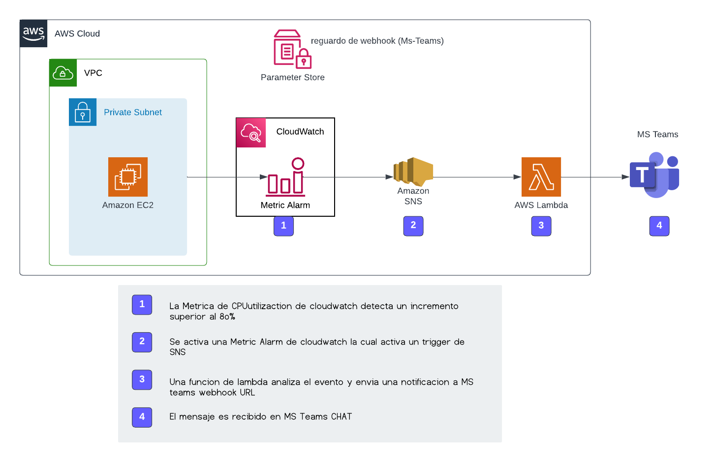
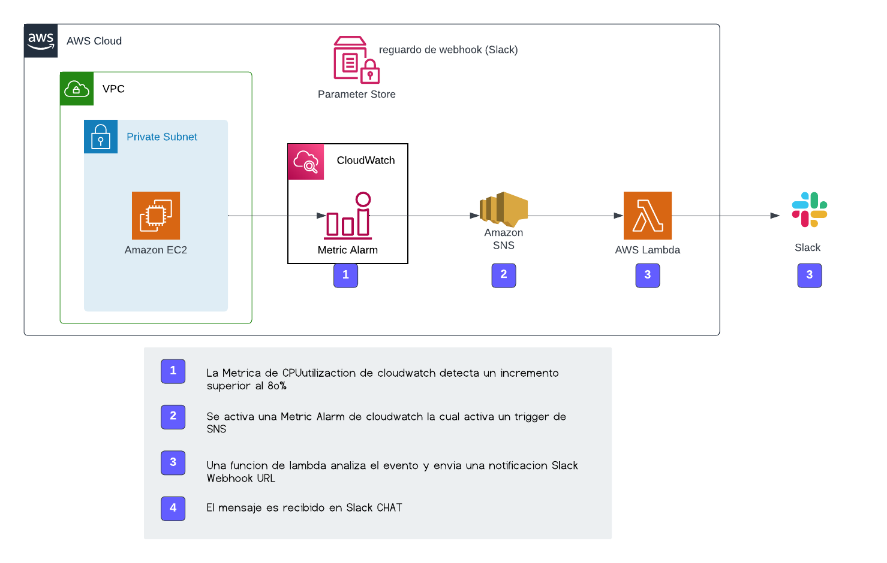

# ms-teams-notifications


## Solucion diagrama MS-Team:
  
  

## Solucion diagrama Slack:
  
  

## Probado con:

| Ambiiente         | aplicacion | Version |
| ----------------- | ---------- | ------- |
| WSL2 Ubuntu 20.04 | Terraform  | v1.2.3  |
| WSL2 Ubuntu 20.04 | aws-cli    | v2.7.9 |

## Procedimiento de inicializacion:

Create a `default.auto.tfvars` file with the following content:

```bash
### Global variables:
aws_profile   = "Profile"
aws_region    = "Region"
project-tags  = {
  Service     = "Service",
  CreatedBy   = "Email"
  Env         = "Environment"
}

### EC2 Module:
vpc_id          = "vpc_id"
subnet_id       = "subnet_id"
instance_type   = "tipo de instancia"

### MS Teams Notification Module:
teams_webhook_url = "URL del webhook de MS-Teams"
slack_webhook_url = "URL del webhook Slak"
```
Clonar el proyecto 

```bash
  git clone -b [Nombre de la branch] + [URL del repositorio]
  Ejemplo:
  git clone -b vpc https://github.com/cloudhesive/terraform_IaC.git 
```

Ir al directorio del proyecto

```bash
  cd teraform_IaC
  git switch ms-teams-notifications
```

Ubicado en el directorio donde se encuentra en manifiesto de terraform, haga un "aws configure" para iniciar sesión en la cuenta de aws y un "terraform init" para descargar los módulos necesarios e iniciar el backend.

```bash
aws configure
terraform init
```

## Procedimientos de implementación:

Ubicado en el directorio donde se encuentra en manifiesto de terraform, realice los cambios necesarios en el archivo variables.tf y ejecute los manifiestos:

```bash
terraform fmt      = para darle formato a los archivos
terraform validate = validamos que no tengamos alguna inconsistencia en los recursos
terraform apply    = realizamos ya el despliegue de los recursos
terraform destroy  = destruimos todo lo desplegamos en este manisfiesto
```

## Autor:
Hermes Vargas - Hermes.vargas@cloudhesive.com